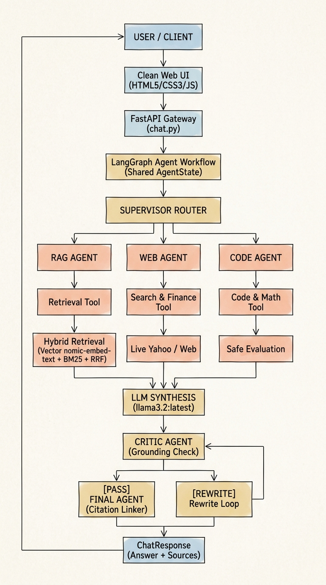

# 🤖 Multi-Agent RAG Intelligence Platform

An enterprise-grade, multi-agent AI system orchestrating **LangGraph**, **Hybrid RAG (Vector Embeddings + BM25 + Reciprocal Rank Fusion)**, **Real-Time Live Web/Market Tools**, and **Local LLM Inference via Ollama (`llama3.2:latest` & `nomic-embed-text:latest`)**.

---

## 📑 Table of Contents

1. [System Architecture & End-to-End Pipeline](#-system-architecture--end-to-end-pipeline)
2. [Node-by-Node Pipeline Deep Dive](#-node-by-node-pipeline-deep-dive)
   - [Node 1: Minimalist Frontend UI](#1-frontend-client-ui)
   - [Node 2: FastAPI API Gateway](#2-fastapi-api-gateway)
   - [Node 3: LangGraph Shared State Manager](#3-langgraph-shared-state-manager)
   - [Node 4: Supervisor & Intent Router Agent](#4-supervisor--intent-router-agent)
   - [Node 5: Specialized Execution Agents](#5-specialized-execution-agents)
   - [Node 6: Hybrid RAG Subsystem](#6-hybrid-rag-subsystem-vector--bm25--rrf)
   - [Node 7: Tool Execution Subsystem](#7-tool-execution-subsystem)
   - [Node 8: Critic & Hallucination Judge Agent](#8-critic--reflection-agent)
   - [Node 9: Final Response & Citation Synthesizer](#9-final-response-agent)
3. [Project Directory Layout](#-project-directory-layout)
4. [Getting Started & Local Setup](#-getting-started--local-setup)
5. [API Reference](#-api-reference)
6. [Automated Testing](#-automated-testing)

---

## 🌐 System Architecture & End-to-End Pipeline

<div align="center">
  
</div>

```text
                                 ┌───────────────────────┐
                                 │      USER / CLIENT    │
                                 └───────────┬───────────┘
                                             │
                                             ▼
                                 ┌───────────────────────┐
                                 │     Clean Web UI      │
                                 │  (HTML5 / CSS3 / JS)  │
                                 └───────────┬───────────┘
                                             │  POST /chat (JSON / Stream)
                                             ▼
                                 ┌───────────────────────┐
                                 │    FastAPI Gateway    │
                                 │  [app/api/chat.py]    │
                                 └───────────┬───────────┘
                                             │
                                             ▼
                     ┌───────────────────────────────────────────────┐
                     │           LANGGRAPH AGENT WORKFLOW            │
                     │             (Shared AgentState)               │
                     └───────────────────────┬───────────────────────┘
                                             │
                                             ▼
                                 ┌───────────────────────┐
                                 │   SUPERVISOR ROUTER   │
                                 │   Classifies Intent   │
                                 └───────────┬───────────┘
                                             │
             ┌───────────────────────────────┼───────────────────────────────┐
             │ [intent: "rag"]               │ [intent: "web"]               │ [intent: "code"]
             ▼                               ▼                               ▼
   ┌──────────────────┐            ┌──────────────────┐            ┌──────────────────┐
   │    RAG AGENT     │            │    WEB AGENT     │            │    CODE AGENT    │
   └────────┬─────────┘            └────────┬─────────┘            └────────┬─────────┘
            │                               │                               │
            ▼                               ▼                               ▼
   ┌──────────────────┐            ┌──────────────────┐            ┌──────────────────┐
   │  Retrieval Tool  │            │ Search & Finance │            │ Code & Math Tool │
   └────────┬─────────┘            └────────┬─────────┘            └────────┬─────────┘
            │                               │                               │
            ▼                               ▼                               ▼
 ┌──────────────────────┐          ┌──────────────────┐            ┌──────────────────┐
 │   HYBRID RETRIEVAL   │          │ Live Yahoo / Web │            │  Safe Evaluation │
 │                      │          └────────┬─────────┘            └────────┬─────────┘
 │ • Vector Search      │                   │                               │
 │   (nomic-embed-text) │                   │                               │
 │ • BM25 Keyword Search│                   │                               │
 │ • RRF Fusion Scoring │                   │                               │
 └──────────┬───────────┘                   │                               │
            │                               │                               │
            └───────────────────────────────┼───────────────────────────────┘
                                            │
                                            ▼
                                 ┌───────────────────────┐
                                 │      LLM SYNTHESIS    │
                                 │   (llama3.2:latest)   │
                                 └───────────┬───────────┘
                                             │
                                             ▼
                                 ┌───────────────────────┐
                                 │     CRITIC AGENT      │
                                 │   Grounding Check &   │
                                 │  Hallucination Judge  │
                                 └───────────┬───────────┘
                                             │
                                    ┌────────┴────────┐
                             [PASS] │                 │ [REWRITE]
                                    ▼                 ▼
                         ┌───────────────────┐ ┌───────────────┐
                         │    FINAL AGENT    │ │ Rewrite Loop  │
                         │ Citation Linker & │ └───────┬───────┘
                         │   Markdown Formatter│       │
                         └─────────┬─────────┘         ▼
                                   │              Re-evaluate
                                   ▼
                         ┌───────────────────┐
                         │   ChatResponse    │
                         │  (Answer + Sources│
                         │   + Latency Meta) │
                         └─────────┬─────────┘
                                   │
                                   ▼
                                 USER
```

---

## 🧩 Node-by-Node Pipeline Deep Dive

### 1. Frontend Client UI
* **Location**: [`frontend/index.html`](file:///Users/macbookpro/iCloud%20Drive%20%28Archive%29/Documents/multi%20agent%20chatbot/frontend/index.html), [`frontend/css/styles.css`](file:///Users/macbookpro/iCloud%20Drive%20%28Archive%29/Documents/multi%20agent%20chatbot/frontend/css/styles.css), [`frontend/js/app.js`](file:///Users/macbookpro/iCloud%20Drive%20%28Archive%29/Documents/multi%20agent%20chatbot/frontend/js/app.js)
* **What it does**:
  - Delivers a clean, distraction-free conversational interface.
  - Features session history, drag-and-drop document upload, real-time Ollama status monitoring, and collapsible sidebar.
  - Automatically formats Markdown, renders code with syntax highlighting (Prism.js), and displays interactive source citation cards.

---

### 2. FastAPI API Gateway
* **Location**: [`app/main.py`](file:///Users/macbookpro/iCloud%20Drive%20%28Archive%29/Documents/multi%20agent%20chatbot/app/main.py), [`app/api/chat.py`](file:///Users/macbookpro/iCloud%20Drive%20%28Archive%29/Documents/multi%20agent%20chatbot/app/api/chat.py), [`app/api/documents.py`](file:///Users/macbookpro/iCloud%20Drive%20%28Archive%29/Documents/multi%20agent%20chatbot/app/api/documents.py)
* **What it does**:
  - Handles incoming HTTP requests, performs strict Pydantic v2 validation, and manages application lifecycles.
  - Directs `POST /chat` to the multi-agent workflow engine.
  - Exposes `POST /documents/upload` for ingestion and `GET /health` for real-time model readiness checks.

---

### 3. LangGraph Shared State Manager
* **Location**: [`app/graph/state.py`](file:///Users/macbookpro/iCloud%20Drive%20%28Archive%29/Documents/multi%20agent%20chatbot/app/graph/state.py), [`app/graph/workflow.py`](file:///Users/macbookpro/iCloud%20Drive%20%28Archive%29/Documents/multi%20agent%20chatbot/app/graph/workflow.py)
* **What it does**:
  - Maintains a shared TypedDict context (`AgentState`) passed between every step in the pipeline.
  - Stores `user_query`, `intent`, `selected_agents`, `retrieved_documents`, `web_results`, `draft_answer`, `critique`, `sources`, and `latency_seconds`.

---

### 4. Supervisor & Intent Router Agent
* **Location**: [`app/agents/supervisor.py`](file:///Users/macbookpro/iCloud%20Drive%20%28Archive%29/Documents/multi%20agent%20chatbot/app/agents/supervisor.py)
* **How it works**:
  - Analyzes the user's prompt using semantic rules and intent classification to determine which specialized agents are required.
  - **Routing Decisions**:
    - **`intent: "rag"`** ➔ User asks about internal documents, policies, files, or uploaded PDFs.
    - **`intent: "web"`** ➔ User asks about real-time market data, current stock prices, news, or weather.
    - **`intent: "code"`** ➔ User asks for code analysis, syntax debugging, or math calculations.
    - **`intent: "general"`** ➔ Conversational questions and reasoning (bypasses heavy tools).

---

### 5. Specialized Execution Agents

#### 📚 RAG Agent ([`app/agents/rag_agent.py`](file:///Users/macbookpro/iCloud%20Drive%20%28Archive%29/Documents/multi%20agent%20chatbot/app/agents/rag_agent.py))
* Executes top-K hybrid retrieval against the document knowledge base.
* Constructs evidence blocks and instructs the LLM to ground answers exclusively in the retrieved context.

#### 🌐 Web Search Agent ([`app/agents/web_agent.py`](file:///Users/macbookpro/iCloud%20Drive%20%28Archive%29/Documents/multi%20agent%20chatbot/app/agents/web_agent.py))
* Invokes live market tools (e.g., Yahoo Finance API) and web search tools.
* Formats real-time facts, stock quotes, and URLs, explicitly bypassing offline model knowledge cutoffs.

#### 💻 Code Agent ([`app/agents/code_agent.py`](file:///Users/macbookpro/iCloud%20Drive%20%28Archive%29/Documents/multi%20agent%20chatbot/app/agents/code_agent.py))
* Analyzes algorithms, debugs code snippets, and runs safe AST math evaluation.

#### 🤖 General Agent ([`app/agents/general_agent.py`](file:///Users/macbookpro/iCloud%20Drive%20%28Archive%29/Documents/multi%20agent%20chatbot/app/agents/general_agent.py))
* Handles everyday dialogue and general knowledge without invoking unnecessary external tools.

---

### 6. Hybrid RAG Subsystem (Vector + BM25 + RRF)
* **Location**: [`app/rag/loaders.py`](file:///Users/macbookpro/iCloud%20Drive%20%28Archive%29/Documents/multi%20agent%20chatbot/app/rag/loaders.py), [`app/rag/chunking.py`](file:///Users/macbookpro/iCloud%20Drive%20%28Archive%29/Documents/multi%20agent%20chatbot/app/rag/chunking.py), [`app/rag/hybrid.py`](file:///Users/macbookpro/iCloud%20Drive%20%28Archive%29/Documents/multi%20agent%20chatbot/app/rag/hybrid.py), [`app/rag/ingestion.py`](file:///Users/macbookpro/iCloud%20Drive%20%28Archive%29/Documents/multi%20agent%20chatbot/app/rag/ingestion.py)
* **The 4-Step Ingestion & Retrieval Process**:
  1. **Extraction & Chunking**: Parses PDFs, TXT, and Markdown files into semantic chunks (600 chars with 100 char overlap) with page and document ID metadata.
  2. **Dense Vector Embeddings**: Generates 768-dimensional normalized embeddings via Ollama `nomic-embed-text:latest`.
  3. **Sparse BM25 Indexing**: Tokenizes chunks for keyword and exact-term matching.
  4. **Reciprocal Rank Fusion (RRF)**: Combines dense semantic rank and sparse keyword rank using the standard RRF formula:
     $$\text{RRF Score}(d) = \sum_{m \in \{\text{Vector}, \text{BM25}\}} \frac{1}{k + r_m(d)}$$
     where $k=60$ and $r_m(d)$ is the document rank in method $m$.

---

### 7. Tool Execution Subsystem
* **Location**: [`app/tools/search_tool.py`](file:///Users/macbookpro/iCloud%20Drive%20%28Archive%29/Documents/multi%20agent%20chatbot/app/tools/search_tool.py), [`app/tools/code_tool.py`](file:///Users/macbookpro/iCloud%20Drive%20%28Archive%29/Documents/multi%20agent%20chatbot/app/tools/code_tool.py), [`app/tools/retrieval_tool.py`](file:///Users/macbookpro/iCloud%20Drive%20%28Archive%29/Documents/multi%20agent%20chatbot/app/tools/retrieval_tool.py)
* **What it does**:
  - Provides real-time market data resolution for ticker symbols (e.g., AAPL, TSLA, 005930.KS).
  - Performs safe math evaluation using Python's AST parser without dangerous `eval()`.
  - Interfaces directly with the hybrid knowledge base.

---

### 8. Critic & Reflection Agent
* **Location**: [`app/agents/critic_agent.py`](file:///Users/macbookpro/iCloud%20Drive%20%28Archive%29/Documents/multi%20agent%20chatbot/app/agents/critic_agent.py)
* **What it does**:
  - Inspects the draft response before it reaches the user.
  - **Grounding Validation**: Checks if the answer's assertions are supported by the retrieved evidence.
  - **Cutoff Filter**: Detects if an LLM inappropriately emitted a "knowledge cutoff" apology when live tools were successfully executed, triggering a self-correction rewrite.

---

### 9. Final Response Agent
* **Location**: [`app/agents/final_agent.py`](file:///Users/macbookpro/iCloud%20Drive%20%28Archive%29/Documents/multi%20agent%20chatbot/app/agents/final_agent.py)
* **What it does**:
  - Formats the final answer into clean GitHub-flavored Markdown.
  - Attaches structured `SourceCitation` metadata (document name, page number, confidence score, snippet preview).
  - Measures total execution latency and returns the structured `ChatResponse`.

---

## 📁 Project Directory Layout

```text
multi agent chatbot/
├── app/
│   ├── agents/          # Specialized Agents (Supervisor, RAG, Web, Code, Critic, Final)
│   ├── api/             # API Endpoints (chat.py, health.py, documents.py)
│   ├── config/          # Pydantic Settings & Environment configuration
│   ├── database/        # Database layer
│   ├── graph/           # LangGraph State & Workflow Orchestration
│   ├── memory/          # Memory managers
│   ├── models/          # Data Schemas (Pydantic v2)
│   ├── rag/             # Ingestion, Loaders, Chunking, Hybrid Vector + BM25 Engine
│   ├── services/        # Ollama LLM & Embedding integration
│   ├── tools/           # Real-Time Search, Finance, and Math Tools
│   ├── utils/           # Logging & Security utilities
│   ├── dependencies.py  # Dependency injection
│   └── main.py          # FastAPI application entrypoint
├── documents/           # Indexed Knowledge Base documents
├── frontend/            # Clean Web UI (index.html, styles.css, app.js)
├── tests/               # Automated unit & integration tests
├── .env / .env.example  # Environment configurations
├── requirements.txt     # Python dependencies
└── README.md            # Architecture & Documentation
```

---

## 🚀 Getting Started & Local Setup

### 1. Prerequisites

- **Python 3.9+**
- **Ollama** running locally with the required models:
  ```bash
  ollama pull llama3.2:latest
  ollama pull nomic-embed-text:latest
  ```

### 2. Install Dependencies

```bash
pip install -r requirements.txt
```

### 3. Start the Server

```bash
python3 -m uvicorn app.main:app --host 0.0.0.0 --port 8000 --reload
```

### 4. Open in Browser

* 🌟 **Web Interface**: [http://localhost:8000/](http://localhost:8000/)
* 📖 **Swagger API Docs**: [http://localhost:8000/docs](http://localhost:8000/docs)
* 🩺 **Health Check**: [http://localhost:8000/health](http://localhost:8000/health)

---

## 📡 API Reference

### Chat Endpoint
* **`POST /chat`**
  ```json
  {
    "conversation_id": "conv_123",
    "message": "What is the reporting deadline for a lost laptop under this policy?",
    "stream": false
  }
  ```
* **Response**:
  ```json
  {
    "conversation_id": "conv_123",
    "answer": "According to Section 6 of the Enterprise Privacy Policy, any lost laptop or data breach must be reported to security-incident@company.com within two (2) hours of discovery.",
    "agent": "rag_agent",
    "sources": [
      {
        "document": "enterprise_privacy_policy.txt",
        "page": 1,
        "score": 0.95
      }
    ],
    "confidence": 0.95,
    "latency_seconds": 1.42
  }
  ```

### Document Upload Endpoint
* **`POST /documents/upload`** (Multipart Form Data with file)
* **`GET /documents`** (Lists all indexed files)

---

## 🧪 Automated Testing

Run the test suite using `pytest`:

```bash
pytest tests/
```
